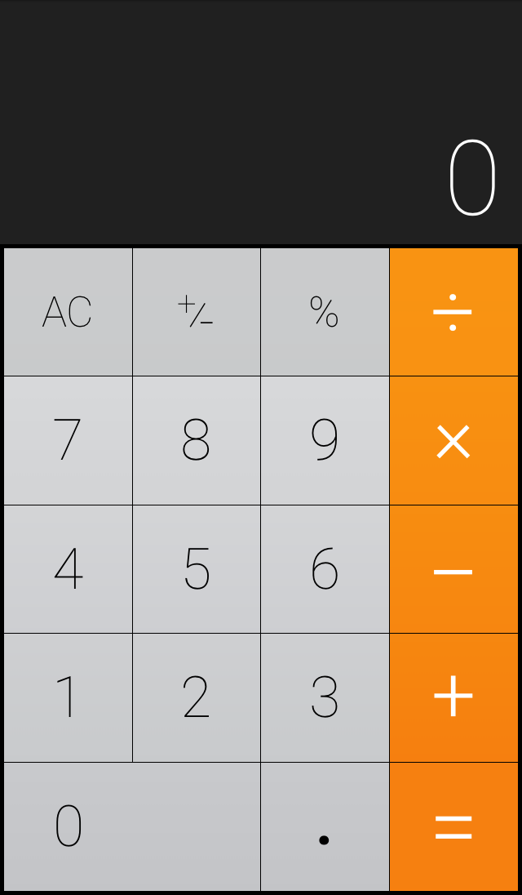

iOS Calculator with HTML, CSS, and JS
-------------------------------------

Prerequisites
-------------

1. Node.js 6.5.0.
1. npm.

Installation
------------

1. Run `npm rebuild` first.
1. Afterwards, run `./jake.sh` to build.
1. And then use `./jake.sh run` to run a local server.

To see all available tasks, use `./jake.sh -T`.

But why?
--------
This is a small project I made for fun. I'm aware that it's not an exact clone of the iOS calculator, that there are so many small imperfections like the "plus-minus" sign looking kind of awkward, the lines in the operator signs not being exactly the same width, etc.

Legal
-----
This project is not affiliated or endorsed by Apple, and it is released under the MIT license.
